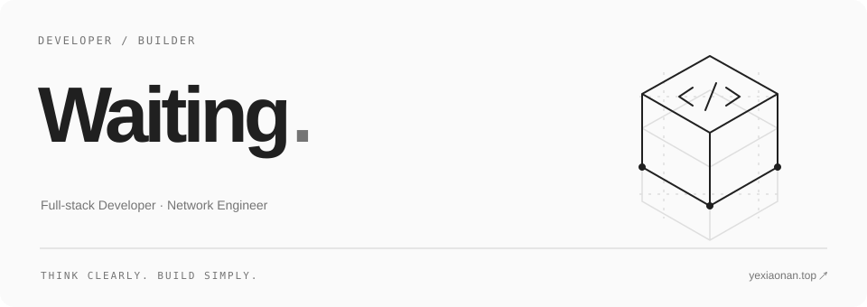
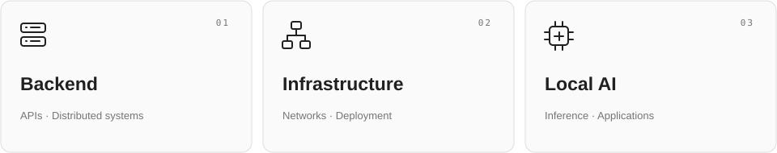

<picture>
  <source media="(prefers-color-scheme: dark)" srcset="./assets/header-dark.svg">
  
</picture>

 

### 热爱编程，专注项目落地。

我是 **Waiting**，关注后端系统、网络工程与 AI 本地推理。 
喜欢从具体问题出发，把想法做成可以使用的软件，让系统保持简单、可靠、易于维护。

从需求到代码，从开发到部署，持续学习，持续构建。

 

<picture>
  <source media="(prefers-color-scheme: dark)" srcset="./assets/focus-dark.svg">
  
</picture>

 

### Stack / 技术栈

**后端开发** · Java / Go / Python · Spring Boot / Spring Cloud / Gin 
**系统与网络** · Linux / Docker / Kubernetes / Nginx 
**工程实践** · CI/CD / Observability / 服务治理

<picture>
  <source media="(prefers-color-scheme: dark)" srcset="https://skillicons.dev/icons?i=java,go,python,spring,linux,docker,kubernetes,nginx&amp;theme=dark&amp;perline=8">
  
</picture>

 

### Elsewhere / 找到我

[个人网站 ↗](https://www.yexiaonan.top/) · [Email ↗](mailto:yexiaonanair@outlook.com)

把想法写成代码，把细节做进体验。
